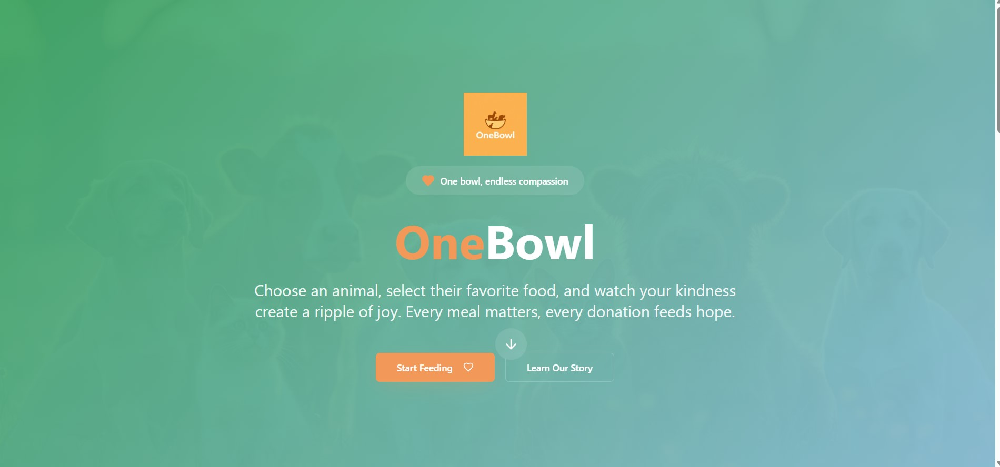
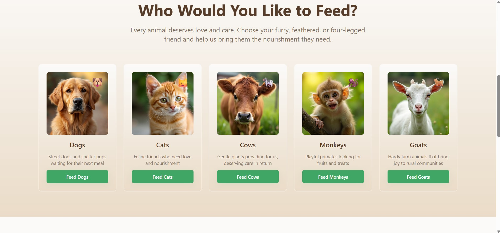
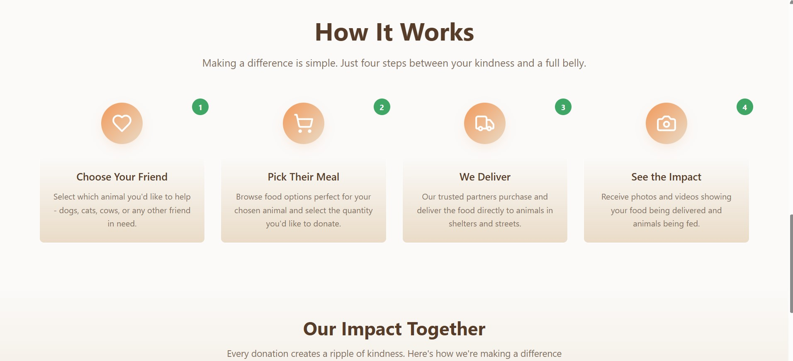
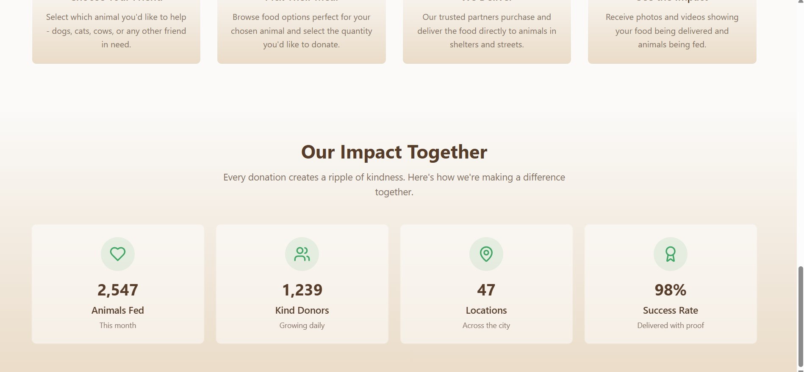

# 🥣 OneBowl – Every Animal Deserves OneBowl 🐾

OneBowl is an **open-source platform** designed to make feeding stray animals simple, transparent, and impactful.  
Donors can select animals (dogs, cats, cows, monkeys, etc.), choose food items, donate securely, and **track their impact** with real proof (photos/videos of animals being fed).  

---

## ✨ Features

- 🐶 **Animal-first donations** – Choose which animal you want to feed.  
- 🥗 **Food selection** – Select food items & quantity (dog food, milk, fruits, fodder, etc.).  
- 💳 **Secure payments** – Donate via UPI, cards, or wallets.  
- 📦 **Order tracking** – From "purchased" → "out for delivery" → "delivered".  
- 📸 **Proof of impact** – Get photos & videos of animals receiving food.  
- 👨‍👩‍👧 **Donor dashboard** – Track your history, see stats, and share your contributions.  

---

## 🖼 Demo







## 🚀 Tech Stack

### Frontend
- [React.js](https://react.dev/) / [Next.js](https://nextjs.org/)  
- TailwindCSS + Shadcn/UI for clean, modern UI  
- Framer Motion for smooth animations  

### Backend
- [Node.js](https://nodejs.org/) (Express.js) or Django (Python alternative)  
- REST APIs for handling donations, orders, and proof uploads  

### Database
- PostgreSQL (structured) / MongoDB (flexible for food menus)  
- Redis (for caching & live order tracking)  

### Integrations
- Razorpay / Stripe for payments  
- AWS S3 / Firebase for storing proof photos & videos  
- Firebase/Socket.IO for real-time order updates  

---

## 📂 Project Structure (planned)

```
OneBowl/
├── frontend/        # React/Next.js app (UI)
├── backend/         # Node.js/Django backend APIs
├── docs/            # Documentation, wireframes, designs
└── README.md
```

---

## 🛠️ Installation (in progress)

Clone the repo:
```bash
git clone https://github.com/vaibhavgogo/OneBowl.git
cd OneBowl
```

Setup instructions for frontend & backend will be added soon.

---

## 🤝 Contributing

We welcome contributions from **developers, designers, NGOs, and animal lovers** ❤️  

1. Fork the repository  
2. Create a new branch (`feature/your-feature`)  
3. Commit your changes (`git commit -m 'Add new feature'`)  
4. Push to your branch (`git push origin feature/your-feature`)  
5. Open a Pull Request  

---

## 🌍 Vision

To ensure that **every stray animal gets OneBowl of food** — with complete transparency and accountability.  
One donation = One full bowl.  

---

## 📬 Contact

💻 Project Maintainer: [Vaibhav Sharma](https://github.com/vaibhavgogo)  
🔗 GitHub Repo: [OneBowl](https://github.com/vaibhavgogo/OneBowl)  

---

⭐ If you believe in this mission, **star the repo** and help spread the word!  
